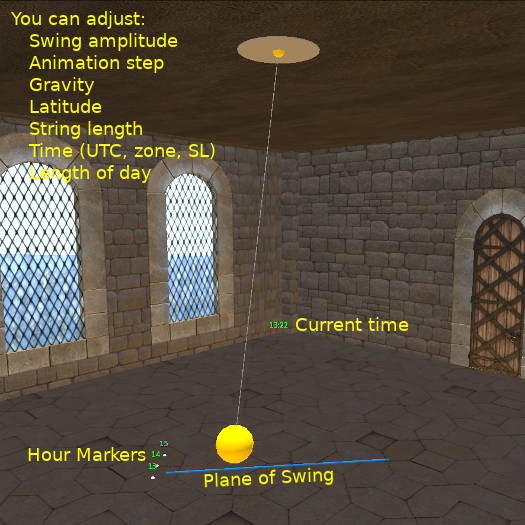

# Fourmilab Foucault Pendulum

[Fourmilab Foucault Pendulum](https://marketplace.secondlife.com/p/Fourmilab-Foucault-Pendulum/17866284)
is a realistic model of a Foucault pendulum for the
[Second Life](https://en.wikipedia.org/wiki/Second_Life) virtual world.

In February, 1851 Léon Foucault invited people to the Paris
Observatory "to observe the rotation of the Earth", then, a few
weeks later, installed a much larger apparatus in Paris's
Panthéon.  The apparatus Foucault invented to directly show the
Earth's rotation, now called a Foucault pendulum, took advantage
of a unique property of a swinging pendulum: the plane in which
the pendulum bob swings (unless perturbed by outside forces such
as wind or friction) remains fixed with respect to the distant
stars.  As the Earth rotates, the plane in which the pendulum
swings will appear to rotate, or precess, through time.  The
rate of precession depends upon the latitude at which the
pendulum is installed: at the north or south pole, it would make
one revolution per sidereal day (the time it takes the distant
stars to return to the same position in the sky as the day
before).  At the latitude of Paris, Foucault's pendulum
precessed around 11.3° per hour.  (The precession rate goes as
the sine of the latitude.)

Fourmilab's Foucault Pendulum brings this demonstration into
Second Life.  You can install the pendulum wherever you wish to
lend a bit of the nineteenth century discovery of science to
your decor.  The pendulum is highly configurable, and can be
customised to your preferences via chat commands.  In addition,
the model, script, and all associated materials are delivered
with full permissions so you can modify them as you like or use
them as the foundation for your own projects.

This repository contains all of the software and resources, including
programs in Linden Scripting Language, notecards, and development
documentation. The actual model is built within Second Life and these
components are installed within it.  (The model is very simple: just
eight "prims" linked together into one object.)

The
[complete model](https://marketplace.secondlife.com/p/Fourmilab-Foucault-Pendulum/17866284)
is available for free in the Second Life Marketplace.  This repository
contains everything in the model (except the prims, which are objects
built within Second Life), plus additional resources for developers who
may wish to extend or adapt the model as they wish.  The model is
delivered with "full permissions": those who obtain it are free to
copy, modify, and transfer it to other users within Second Life.

All of this software is licensed under the Creative Commons
Attribution-ShareAlike license.  Please see LICENSE.md in this
repository for details.
